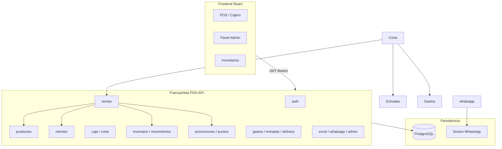
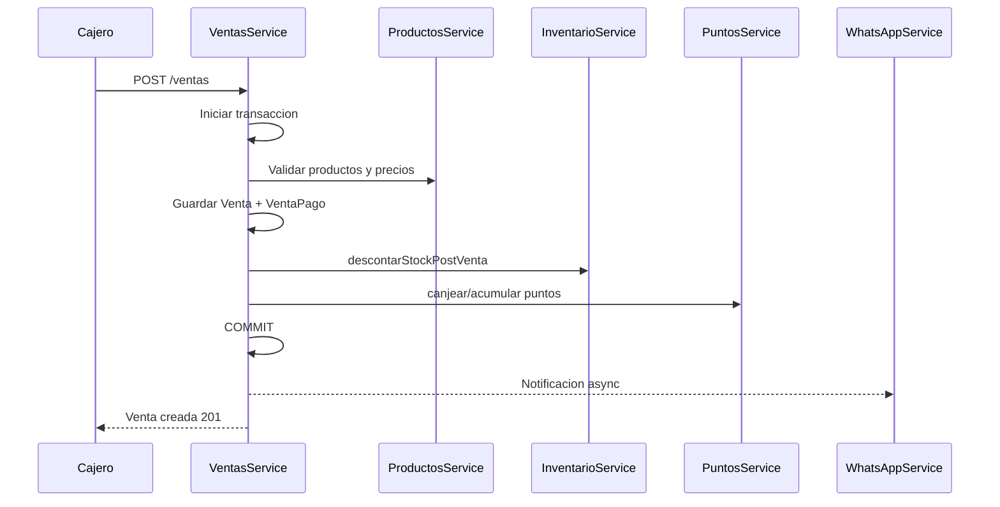
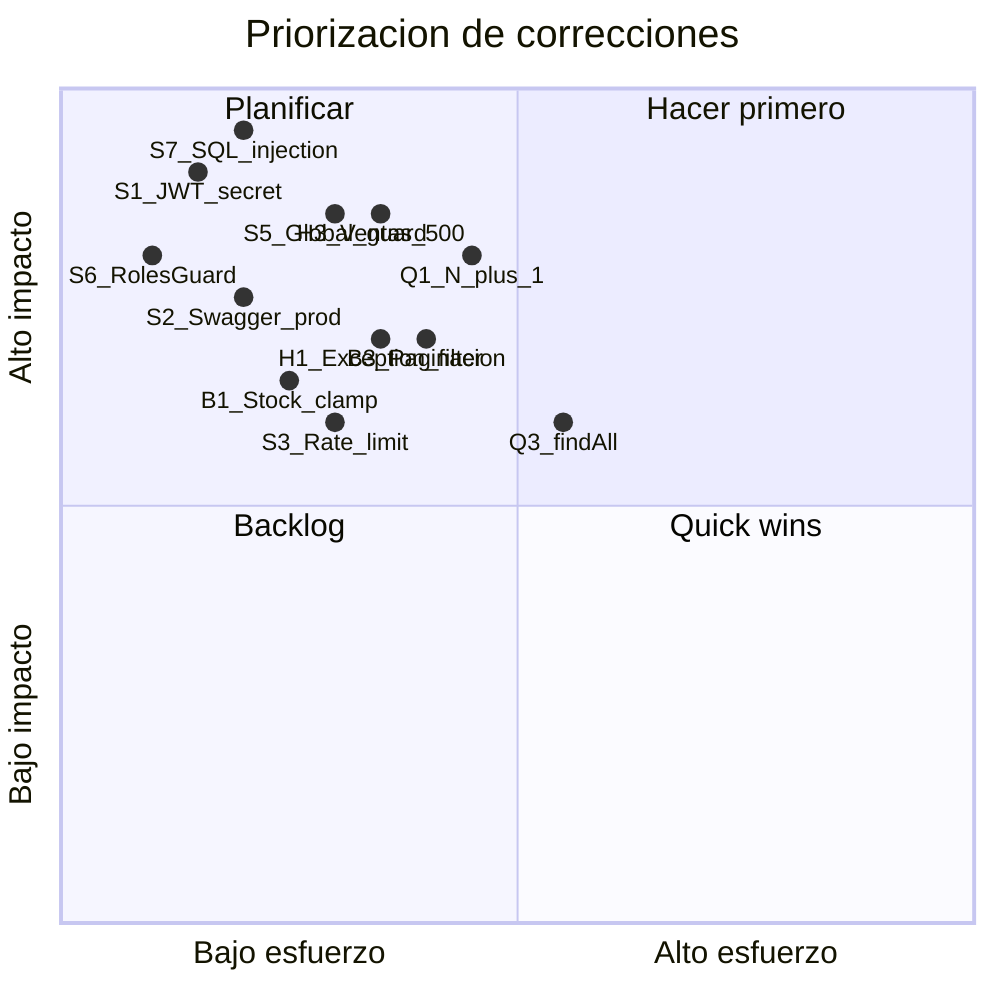

# PRD y Auditoría de Seguridad/Arquitectura — Francachela POS

## 1. Resumen Ejecutivo del Producto

**Francachela POS** es un backend REST API (NestJS 11 + TypeScript + PostgreSQL + TypeORM) que soporta las operaciones de un punto de venta para un negocio de retail (bebidas/comercio). Expone ~131 endpoints en 17 controladores bajo [`src/modulos/`](src/modulos/). El frontend React vive en un repositorio separado (Vercel).

**Stack:** NestJS, JWT/Passport, class-validator, Swagger (`/api`), ExcelJS (reportes), Baileys (WhatsApp), Docker/Fly.io.



---

## 2. PRD — Product Requirements Document

### 2.1 Visión y Propósito

Proveer una API robusta, segura y transaccional para gestionar el ciclo completo de operaciones POS: catálogo, ventas, fidelización, caja, inventario, delivery, gastos y reportes, con notificaciones WhatsApp opcionales.

### 2.2 Usuarios y Roles

| Rol | Persona | Necesidades principales |
|-----|---------|------------------------|
| **ADMIN** | Dueño / gerente | Control total, usuarios, promociones, corte, exportaciones, WhatsApp, secuencias DB |
| **CAJERO** | Operador POS | Ventas, clientes, caja, delivery, gastos, consultas de inventario |
| **INVENTARIOS** | Almacén | Productos, stock, movimientos, alertas de stock bajo |

Definidos en [`src/entities/usuario.entity.ts`](src/entities/usuario.entity.ts).

### 2.3 Entidades de Dominio (13 tablas)

| Entidad | Propósito |
|---------|-----------|
| `Usuario` | Autenticación y RBAC |
| `Producto` | Catálogo, precios, stock, puntos |
| `Cliente` | CRM, DNI, puntos acumulados |
| `Venta` + `VentaPago` | Transacciones POS con pagos normalizados |
| `ClientePuntosMovimiento` | Auditoría de puntos |
| `PromocionUnificada` + `PromocionProducto` | Descuentos/combos unificados |
| `Caja` | Apertura/cierre de turno |
| `Gasto` | Egresos operativos |
| `Entrada` | Ingresos no-venta (para corte) |
| `Delivery` | Pedidos a domicilio |
| `MovimientoInventario` | Trazabilidad de stock |

### 2.4 Módulos Funcionales y Requisitos

#### Auth (`/auth`)
- **RF-001:** Login con username/password → JWT (expira en 1h según [`auth.module.ts`](src/modulos/auth/auth.module.ts))
- **RF-002:** Perfil del usuario autenticado
- **RF-003:** Rechazar usuarios inactivos en login

#### Usuarios (`/users`) — Solo ADMIN
- **RF-010:** CRUD usuarios con roles; soft-delete (`activo: false`)

#### Productos (`/productos`)
- **RF-020:** CRUD catálogo con código de barras único, categorías, proveedores
- **RF-021:** Control de stock (lectura CAJERO; escritura ADMIN/INVENTARIOS)
- **RF-022:** Alertas de stock bajo
- **RF-023:** Historial de movimientos por producto

#### Clientes (`/clientes`)
- **RF-030:** CRUD clientes con DNI, teléfono, código corto
- **RF-031:** Búsqueda, top clientes, cumpleañeros
- **RF-032:** Estadísticas de compra por cliente
- **RF-033:** Sistema de puntos (canje/acumulación delegado a `PuntosService`)

#### Ventas (`/ventas`) — Módulo orquestador central
- **RF-040:** Preview de venta (cálculos sin persistir)
- **RF-041:** Crear venta transaccional: validar productos, pagos, stock, puntos
- **RF-042:** Consulta de venta por ticket
- **RF-043:** Anulación de ventas
- **RF-044:** Corte de ventas por rango de fechas
- **RF-045:** Notificación WhatsApp post-venta (async, fuera de transacción)

#### Promociones (`/promociones`)
- **RF-050:** CRUD promociones unificadas (ADMIN)
- **RF-051:** Evaluación de promociones aplicables a un carrito

#### Puntos (`/puntos`)
- **RF-060:** Evaluación server-side de puntos (migrado desde frontend)
- **RF-061:** Ajuste manual de puntos (solo ADMIN)
- **RF-062:** Historial de movimientos por cliente

#### Caja (`/caja`)
- **RF-070:** Apertura/cierre de caja por cajero
- **RF-071:** Estado actual y resumen del turno
- **RF-072:** Historial y estadísticas (estadísticas solo ADMIN)

#### Corte (`/corte`)
- **RF-080:** Conciliación ventas + entradas + gastos por rango
- **RF-081:** Export Excel de corte (solo ADMIN)

#### Entradas (`/entradas`)
- **RF-090:** Registro de ingresos no-venta; edición/eliminación solo ADMIN

#### Gastos (`/gastos`)
- **RF-100:** Registro y categorización; CAJERO puede crear/editar, no eliminar

#### Delivery (`/delivery`)
- **RF-110:** Ciclo de vida: pendiente → asignado → en camino → entregado/cancelado

#### Movimiento Inventario (`/movimiento-inventario`)
- **RF-120:** Entradas, salidas, ajustes con auditoría
- **RF-121:** Movimiento automático post-venta (vía `InventarioService`)

#### Excel (`/excel`)
- **RF-130:** Exportación de ventas, productos, clientes, inventario, delivery, pagos

#### WhatsApp (`/whatsapp`)
- **RF-140:** Envío de mensajes, notificaciones de venta/delivery/combo
- **RF-141:** Gestión de sesión Baileys (QR, reconnect, logout — ADMIN)

#### Admin (`/admin`)
- **RF-150:** Sincronización de secuencias PostgreSQL post-importación manual

### 2.5 Requisitos No Funcionales

| ID | Requisito | Estado actual |
|----|-----------|---------------|
| **RNF-001** | Autenticación JWT en todos los endpoints de negocio | Parcial — opt-in por controlador, no global |
| **RNF-002** | RBAC por rol en cada endpoint | Implementado en 15/17 controladores |
| **RNF-003** | Validación de entrada con DTOs | Global `ValidationPipe`; gaps en WhatsApp/movimiento-inventario |
| **RNF-004** | Transacciones ACID en ventas | Implementado con QueryRunner |
| **RNF-005** | Rate limiting en login | **No implementado** |
| **RNF-006** | Swagger solo en desarrollo | **Expuesto siempre en `/api`** |
| **RNF-007** | Paginación en listados | Inconsistente — muchos `findAll()` sin límite |
| **RNF-008** | Códigos HTTP semánticos | Inconsistente — envelopes `{ success: false }` con HTTP 200 |
| **RNF-009** | Disponibilidad WhatsApp | Degradación graceful (app sigue sin WhatsApp) |

### 2.6 Flujo Crítico: Crear Venta



### 2.7 Integraciones Externas

- **Frontend React** (Vercel): CORS configurado en [`main.ts`](src/main.ts)
- **PostgreSQL**: `DATABASE_URL` con SSL en producción
- **WhatsApp (Baileys)**: sesión persistente en volumen Fly.io
- **Sin integración de pagos externos** (efectivo, tarjeta, transferencia registrados manualmente)

### 2.8 Métricas de Éxito Propuestas

- Tiempo de respuesta POST `/ventas` < 500ms (p95)
- 0 ventas con stock negativo
- 100% endpoints de negocio protegidos con JWT
- 0 errores de negocio devueltos como HTTP 500
- Corte de caja cuadra con ventas + entradas - gastos

### 2.9 Roadmap Sugerido (post-auditoría)

**Fase 1 — Seguridad crítica (1-2 semanas)**
- Global JWT guard + decorator `@Public()`
- Eliminar fallbacks de JWT secret
- Whitelist en `sync-sequence/:tableName`
- Rate limiting en login
- Deshabilitar Swagger en producción

**Fase 2 — Consistencia API (2-3 semanas)**
- Filtro global de excepciones
- Estandarizar códigos HTTP y response DTOs
- Corregir inner-catch en `ventas.service.ts`
- Unificar lógica de stock y puntos

**Fase 3 — Performance (2-4 semanas)**
- Paginación obligatoria en `findAll()`
- Eliminar N+1 en validación de productos
- Agregaciones SQL en módulo corte
- Límites en exportaciones Excel

---

## 3. Reporte de Auditoría — Tabla Resumida

### 3.1 Seguridad y Autenticación

| # | Hallazgo | Severidad | Módulos / Archivos | Corrección sugerida |
|---|----------|-----------|-------------------|---------------------|
| S1 | JWT secret con fallback `'default-secret'` / `'default-secret-key'` si env no está definida | **Crítica** | [`jwt.config.ts`](src/config/jwt.config.ts), [`auth.module.ts`](src/modulos/auth/auth.module.ts) | Fallar al iniciar si `JWT_SECRET` ausente; eliminar defaults |
| S2 | Swagger público en `/api` con `persistAuthorization: true` | **Crítica** | [`main.ts`](src/main.ts) | Condicionar a `NODE_ENV !== 'production'` o proteger con auth básica |
| S3 | Sin rate limiting en `POST /auth/login` | **Alta** | [`auth.controller.ts`](src/modulos/auth/auth.controller.ts) | Agregar `@nestjs/throttler` (ej. 5 req/min por IP) |
| S4 | JWT valida solo payload, no re-consulta DB (`activo`, rol actualizado) | **Alta** | [`jwt.strategy.ts`](src/modulos/auth/strategies/jwt.strategy.ts) | En `validate()`, cargar usuario de DB y rechazar si `activo === false` |
| S5 | Sin guard JWT global — nuevos controladores quedan públicos por defecto | **Alta** | Todos los módulos | Registrar `APP_GUARD` con `JwtAuthGuard` + decorator `@Public()` para login/root |
| S6 | `RolesGuard` usa `user.rol.includes(role)` (substring) en vez de igualdad | **Alta** | [`roles.guard.ts`](src/common/guards/roles.guard.ts) | Cambiar a `requiredRoles.includes(user.rol)` |
| S7 | SQL injection: `tableName` interpolado en query sin whitelist | **Crítica** | [`admin.controller.ts`](src/modulos/admin/admin.controller.ts), [`sequence-sync.util.ts`](src/common/utils/sequence-sync.util.ts) | Validar `tableName` contra lista fija (`tablesToSync`); rechazar con 400 si no coincide |
| S8 | Campo `cajero` viene del body, no de `@CurrentUser()` | **Media** | [`movimiento-inventario.controller.ts`](src/modulos/movimiento-inventario/movimiento-inventario.controller.ts) | Usar `@CurrentUser()` para identidad del operador |
| S9 | DTOs inline sin validación en WhatsApp y movimiento-inventario | **Media** | [`whatsapp.controller.ts`](src/modulos/whatsapp/whatsapp.controller.ts), movimiento-inventario | Crear DTOs con `class-validator` |
| S10 | Sin Helmet ni security headers | **Media** | [`main.ts`](src/main.ts) | `app.use(helmet())` |
| S11 | CAJERO puede anular ventas, exportar datos masivos, enviar WhatsApp arbitrario | **Media** | ventas, excel, whatsapp | Revisar matriz RBAC según política de negocio; restringir acciones de alto impacto |
| S12 | `ValidationGuard` y decoradores `@ValidateStock` definidos pero nunca usados | **Baja** | [`validation.guard.ts`](src/common/guards/validation.guard.ts) | Conectar o eliminar código muerto |
| S13 | DB SSL `rejectUnauthorized: false` en producción | **Baja** | [`app.module.ts`](src/app.module.ts) | Usar certificado CA válido |
| S14 | Expiración JWT inconsistente: módulo `1h` vs config `24h` | **Baja** | auth.module vs jwt.config | Unificar en una sola fuente de verdad |

**Estado de guards:** 15 controladores con `@UseGuards(JwtAuthGuard, RolesGuard)`. Solo `GET /` y `POST /auth/login` son públicos intencionalmente. `GET /auth/profile` tiene JWT sin `RolesGuard`.

---

### 3.2 Consistencia en Códigos HTTP

| # | Hallazgo | Severidad | Módulos / Archivos | Corrección sugerida |
|---|----------|-----------|-------------------|---------------------|
| H1 | Sin filtro global de excepciones; `throw new Error()` → HTTP 500 | **Alta** | [`main.ts`](src/main.ts), [`date-range.dto.ts`](src/common/dto/date-range.dto.ts), [`productos.service.ts`](src/modulos/productos/productos.service.ts) | Crear `HttpExceptionFilter` global; usar solo excepciones Nest |
| H2 | `{ success: false }` devuelto con HTTP 200 | **Alta** | [`admin.service.ts`](src/modulos/admin/admin.service.ts), [`whatsapp.controller.ts`](src/modulos/whatsapp/whatsapp.controller.ts) | Lanzar `HttpException` con status apropiado (4xx/5xx) |
| H3 | Errores de negocio envueltos como 500 en ventas | **Alta** | [`ventas.service.ts`](src/modulos/ventas/ventas.service.ts) L218-267 | Re-lanzar `BadRequestException`/`NotFoundException` en inner-catch antes de wrappear |
| H4 | `clientes.findAll()` lanza 404 si lista vacía; otros módulos retornan `[]` | **Media** | [`clientes.service.ts`](src/modulos/clientes/clientes.service.ts) | Retornar `[]` con HTTP 200 (estándar REST) |
| H5 | Entidad no encontrada: 404 vs 400 según módulo | **Media** | puntos (400), delivery/clientes (404) | Convención: recurso inexistente → `NotFoundException` (404); regla de negocio → `BadRequestException` (400) |
| H6 | Puntos insuficientes: 409 en clientes, 400 en puntos/validation | **Media** | clientes vs puntos | Unificar en `BadRequestException` (400) o `ConflictException` (409) en todo el sistema |
| H7 | WhatsApp POST devuelve 201 por defecto incluso en fallo (`success: false`) | **Media** | whatsapp | Usar `@HttpCode(200)` + envelope o lanzar excepción con status correcto |
| H8 | `caja.getEstadoCaja` oculta errores DB como "caja cerrada" | **Media** | [`caja.service.ts`](src/modulos/caja/caja.service.ts) | Distinguir error de infraestructura (503) de estado de negocio |

---

### 3.3 Inconsistencias en Lógica de Negocio

| # | Hallazgo | Severidad | Módulos | Corrección sugerida |
|---|----------|-----------|---------|---------------------|
| B1 | Stock SALIDA: `productos` hace clamp a 0; `movimiento-inventario` e `inventario` lanzan error | **Alta** | productos vs movimiento-inventario vs inventario | Unificar: siempre validar y rechazar si stock insuficiente |
| B2 | Soft-delete (usuarios, clientes, productos) vs hard-delete (gastos) | **Media** | users, clientes, productos, gastos | Documentar política; alinear gastos a soft-delete si se requiere auditoría |
| B3 | `PaginasRangoDto` acepta `page`/`limit` pero servicios ignoran parámetros | **Alta** | ventas, gastos, movimiento-inventario, caja | Pasar `page`/`limit` del DTO al servicio |
| B4 | Formato de paginación inconsistente (`PaginatedResult` vs `{ entradas, pagination }` vs `{ data, total }`) | **Media** | entradas, gastos, productos | Estandarizar en `PaginatedResult<T>` de [`common/interfaces`](src/common/interfaces/) |
| B5 | Puntos: `ajustarPuntos` sin transacción vs `registrarMovimiento` con lock pessimista | **Media** | [`puntos.service.ts`](src/modulos/puntos/puntos.service.ts) | Envolver ajustes en transacción con lock |
| B6 | Corte carga todas las ventas/gastos/entradas en memoria | **Alta** | [`corte.service.ts`](src/modulos/corte/corte.service.ts) | Usar agregaciones SQL (`SUM`, `GROUP BY`) |
| B7 | Ruta `GET /clientes/:id` puede colisionar con `GET /clientes/:dni/estadisticas` | **Media** | [`clientes.controller.ts`](src/modulos/clientes/clientes.controller.ts) | Reordenar rutas estáticas antes de parametrizadas o usar prefijo `/estadisticas/:dni` |

---

### 3.4 Consultas y Manejo de Errores

| # | Hallazgo | Severidad | Módulos / Archivos | Corrección sugerida |
|---|----------|-----------|-------------------|---------------------|
| Q1 | N+1: loop `findById` por cada producto en venta | **Alta** | [`ventas.service.ts`](src/modulos/ventas/ventas.service.ts) ~L807 | `findByIds` / `WHERE id IN (...)` en batch |
| Q2 | N+1: `findOne` por item en `inventario.descontarStockPostVenta` | **Alta** | [`inventario.service.ts`](src/modulos/inventario/inventario.service.ts) | Pre-cargar productos en una query |
| Q3 | `findAll()` sin paginación en tablas grandes | **Alta** | ventas, productos, users, delivery, gastos, promociones | Paginación obligatoria (default limit=50) |
| Q4 | Exportaciones Excel cargan datasets completos | **Alta** | [`excel.service.ts`](src/modulos/excel/excel.service.ts) | Streaming o filtros por rango obligatorios |
| Q5 | API deprecada `repository.findByIds` | **Baja** | productos, puntos, validation | Migrar a `findBy({ id: In(ids) })` |
| Q6 | Try-catch vacío/silencioso: `validateToken` retorna null | **Baja** | [`auth.service.ts`](src/modulos/auth/auth.service.ts) | Loguear tipo de error; propagar si es necesario |
| Q7 | Try-catch en caja enmascara fallos de DB | **Media** | [`caja.service.ts`](src/modulos/caja/caja.service.ts) | Re-lanzar errores no esperados |
| Q8 | Excel: errores por fila silenciados, export "exitoso" con datos corruptos | **Media** | [`excel.service.ts`](src/modulos/excel/excel.service.ts) | Opción: fallar export o reportar filas con error en metadata |
| Q9 | Admin sync: fallos parciales por tabla solo loguean warning | **Media** | [`sequence-sync.util.ts`](src/common/utils/sequence-sync.util.ts) | Retornar reporte con tablas fallidas; no ocultar errores |
| Q10 | WhatsApp init: error fatal silenciado, app sigue sin notificar | **Baja** | [`whatsapp.service.ts`](src/modulos/whatsapp/whatsapp.service.ts) | Endpoint `/whatsapp/status` ya existe; documentar degradación |

---

## 4. Matriz de Priorización de Correcciones



### Top 10 acciones inmediatas (orden recomendado)

1. **S7** — Whitelist `tableName` en admin sequence sync (SQL injection)
2. **S1** — Eliminar JWT secret por defecto; fail-fast en bootstrap
3. **S5 + S6** — Global JWT guard + fix `RolesGuard`
4. **H3** — Re-throw excepciones de negocio en `ventas.service.ts`
5. **S2** — Proteger/deshabilitar Swagger en producción
6. **S3** — Rate limiting en login
7. **S4** — Validar usuario activo en `JwtStrategy.validate()`
8. **H1** — Filtro global de excepciones
9. **B1** — Unificar validación de stock (eliminar clamp silencioso)
10. **B3 + Q3** — Conectar paginación en todos los listados

---

## 5. Convenciones Propuestas (estándar objetivo)

| Situación | Código HTTP | Excepción Nest |
|-----------|-------------|----------------|
| Recurso no existe | 404 | `NotFoundException` |
| Validación / regla de negocio | 400 | `BadRequestException` |
| Conflicto (duplicado, estado inválido) | 409 | `ConflictException` |
| No autenticado | 401 | `UnauthorizedException` |
| Sin permisos | 403 | `ForbiddenException` |
| Creación exitosa | 201 | (default POST) |
| Error interno real | 500 | `InternalServerErrorException` |
| Lista vacía | 200 + `[]` | — |

**Response envelope estándar propuesto:**
```typescript
{ data: T }                           // éxito simple
{ data: T[], meta: { page, limit, total } }  // paginado
{ error: { code, message, details } } // error (con HTTP status correcto)
```

---

## 6. Archivos Clave para Implementar Correcciones

- Bootstrap y seguridad global: [`src/main.ts`](src/main.ts), [`src/app.module.ts`](src/app.module.ts)
- Auth: [`src/modulos/auth/`](src/modulos/auth/)
- Guards: [`src/common/guards/`](src/common/guards/)
- Ventas (lógica crítica): [`src/modulos/ventas/ventas.service.ts`](src/modulos/ventas/ventas.service.ts)
- Admin (SQL): [`src/common/utils/sequence-sync.util.ts`](src/common/utils/sequence-sync.util.ts)
- Paginación compartida: [`src/common/dto/pagination.dto.ts`](src/common/dto/pagination.dto.ts), [`src/common/dto/date-range.dto.ts`](src/common/dto/date-range.dto.ts)

---

## 7. Conclusión de la Auditoría

El proyecto tiene una **base arquitectónica sólida**: módulos NestJS bien separados, RBAC explícito en la mayoría de endpoints, transacciones en ventas, y migraciones TypeORM. Los riesgos principales son de **hardening de producción** (JWT, Swagger, SQL injection en admin) y **consistencia transversal** (HTTP codes, paginación, lógica de stock/puntos). Ningún endpoint de negocio quedó completamente sin autenticación, pero el modelo opt-in de guards es frágil para el crecimiento del código.

**Puntuación estimada de madurez API:**

| Dimensión | Nota (1-10) |
|-----------|-------------|
| Autenticación/Autorización | 6/10 |
| Consistencia HTTP | 5/10 |
| Lógica de negocio | 7/10 |
| Manejo de errores | 5/10 |
| Performance de queries | 5/10 |
| Documentación (Swagger) | 8/10 |
| Arquitectura modular | 8/10 |
